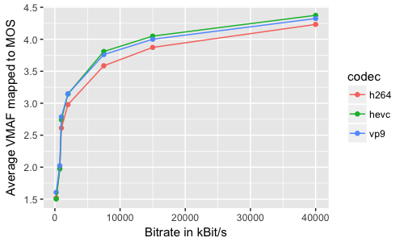

# Codec Extension for ITU-T P.1203

This extension to the [`itu-p1203` implementation](https://github.com/itu-p1203/itu-p1203) allows to calculate video quality scores for H.265/HEVC and VP9-encoded video using a custom mapping applied to the P.1203.1 Mode 0 calculation.

**Note:** When this extension is used, the output values will not be compliant to the ITU-T Rec. P.1203.1 standard.

**Important:** This version requires at least version 1.5.0 of the `itu-p1203` software.

## Requirements

- Python 3
- [`itu-p1203` implementation (>v1.5.0)](https://github.com/itu-p1203/itu-p1203)

## Installation

Download this repository, then either install the official ITU-T P1203 software via pip, or clone the official ITU-T P.1203 in this directory:

```
git clone https://github.com/itu-p1203/itu-p1203.git
```

You can also then install *this* package globally via:

```
pip3 install .
```

If you want to use this extension in your software via pip, then you need to manually add the itu-p1203 repository as dependency!

## Usage

Use the extension, with e.g. the `./calculate.py` script in a similar manner like the original `itu-p1203` standalone version.

## Non-Standard Codec Mapping

In order to be able to use this software with other codecs than the P.1203-specified H.264, the software implements a custom mapping function for H.265/HEVC and VP9-encoded streams when using Mode 0. **Note:** When using other codecs than H.264, the resulting values will not be compliant to the official standard. In the future, further updates to the mapping function may be supplied by the authors based on more extensive testing.

The proposed mapping uses a third-order polynomial function:

    y = a*x^3 + b*x^2 + c*x + d

where `y` is the compensated MOS and `x` is the original MOS. The coefficients (`a` through `d`) are the following:

    COEFFS_VP9 = [-0.04129014, 0.30953836, 0.32314399, 0.5284358]
    COEFFS_H265 = [-0.05196039, 0.39430046, 0.17486221, 0.50008018]

To derive the function, a set of six 10 s video-only sequences with various spatiotemporal complexity was chosen, encoded at different bitrates (from 200–40000 kBit/s) and resolutions (from 360p to 2160p) with the `libvpx-vp9` and `libx265` encoders. The encoders were set to use two-pass encoding. The quality of each sequence was calculated with [VMAF](https://github.com/Netflix/vmaf) version 0.6.1 and mapped linearly to a MOS scale from 1–5. The mapping was then derived based on averaging the sequence scores; it has an RMSE of < 0.034.

The relationship between the VMAF scores for these clips, averaged over all sources, are shown in the below figure:



## Acknowledgement

If you use this software in your research, you must follow the acknowledgement rules from [the `itu-p1203` implementation](https://github.com/itu-p1203/itu-p1203/#acknowledgement) and, in doing so:

1. include the link to this repository and 
2. cite the following papers:

    Raake, A., Garcia, M.-N., Robitza, W., List, P., Göring, S., Feiten, B. (2017). A bitstream-based, scalable video-quality model for HTTP adaptive streaming: ITU-T P.1203.1. In 2017 Ninth International Conference on Quality of Multimedia Experience (QoMEX). Erfurt.

        @inproceedings{Raake2017,
        address = {Erfurt},
        author = {Raake, Alexander and Garcia, Marie-Neige and Robitza, Werner and List, Peter and Göring, Steve and Feiten, Bernhard},
        booktitle = {Ninth International Conference on Quality of Multimedia Experience (QoMEX)},
        doi = {10.1109/QoMEX.2017.7965631},
        isbn = {978-1-5386-4024-1},
        month = {May},
        publisher = {IEEE},
        title = {{A bitstream-based, scalable video-quality model for HTTP adaptive streaming: ITU-T P.1203.1}},
        url = {http://ieeexplore.ieee.org/document/7965631/},
        year = {2017}
        }

    Robitza, W., Göring, S., Raake, A., Lindegren, D., Heikkilä, G., Gustafsson, J., List, P., Feiten, B., Wüstenhagen, U., Garcia, M.-N., Yamagishi, K., Broom, S. (2018). HTTP Adaptive Streaming QoE Estimation with ITU-T Rec. P.1203 – Open Databases and Software. In 9th ACM Multimedia Systems Conference. Amsterdam.

        @inproceedings{Robitza2018,
        address = {Amsterdam},
        author = {Robitza, Werner and Göring, Steve and Raake, Alexander and Lindegren, David and Heikkilä, Gunnar and Gustafsson, Jörgen and List, Peter and Feiten, Bernhard and Wüstenhagen, Ulf and Garcia, Marie-Neige and Yamagishi, Kazuhisa and Broom, Simon},
        booktitle = {9th ACM Multimedia Systems Conference},
        doi = {10.1145/3204949.3208124},
        isbn = {9781450351928},
        title = {{HTTP Adaptive Streaming QoE Estimation with ITU-T Rec. P.1203 – Open Databases and Software}},
        year = {2018}
        }

## License

The following license **only** applies to this codec extension. For the license of the original ITU-T P.1203 implementation please carefully [refer to the other repository](https://github.com/itu-p1203/itu-p1203/#license).

Copyright 2018-2020 Technische Universität Ilmenau

Permission is hereby granted, free of charge, to any person obtaining a copy of this software and associated documentation files (the "Software"), to deal in the Software without restriction, including without limitation the rights to use, copy, modify, merge, publish, distribute, sublicense, and/or sell copies of the Software, and to permit persons to whom the Software is furnished to do so, subject to the following conditions:

The above copyright notice and this permission notice shall be included in all copies or substantial portions of the Software.

THE SOFTWARE IS PROVIDED "AS IS", WITHOUT WARRANTY OF ANY KIND, EXPRESS OR IMPLIED, INCLUDING BUT NOT LIMITED TO THE WARRANTIES OF MERCHANTABILITY, FITNESS FOR A PARTICULAR PURPOSE AND NONINFRINGEMENT. IN NO EVENT SHALL THE AUTHORS OR COPYRIGHT HOLDERS BE LIABLE FOR ANY CLAIM, DAMAGES OR OTHER LIABILITY, WHETHER IN AN ACTION OF CONTRACT, TORT OR OTHERWISE, ARISING FROM, OUT OF OR IN CONNECTION WITH THE SOFTWARE OR THE USE OR OTHER DEALINGS IN THE SOFTWARE.

## Authors

Main developers:

* Steve Göring, Technische Universität Ilmenau
* Werner Robitza, Technische Universität Ilmenau
